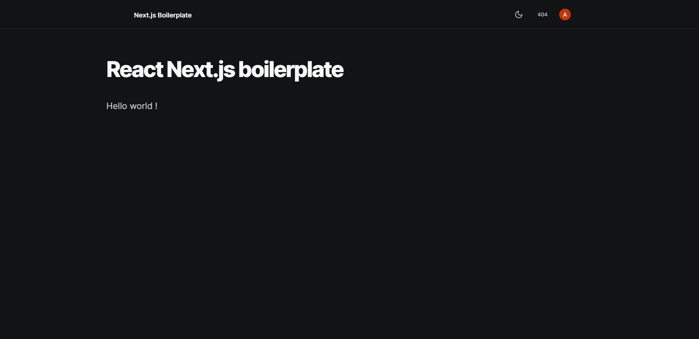
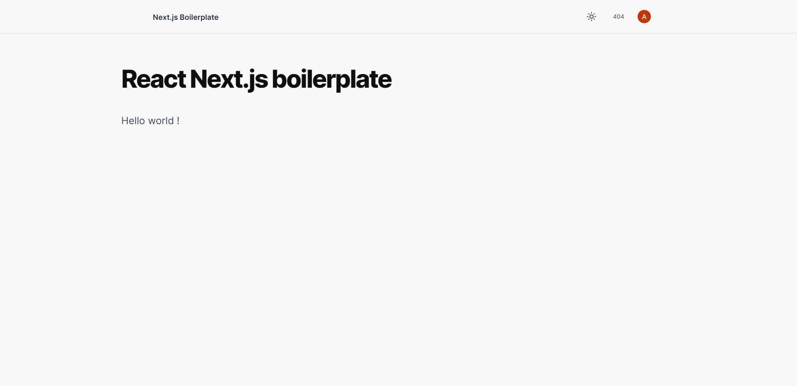
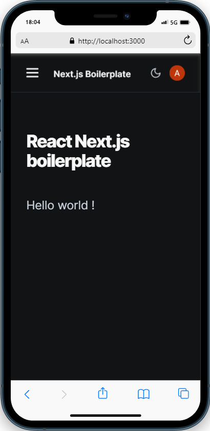
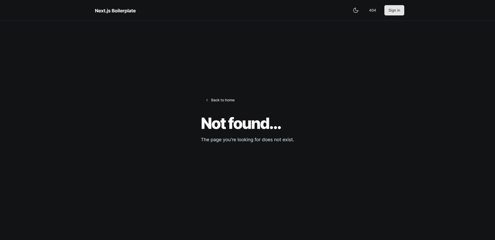
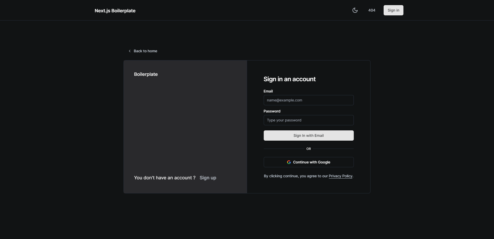
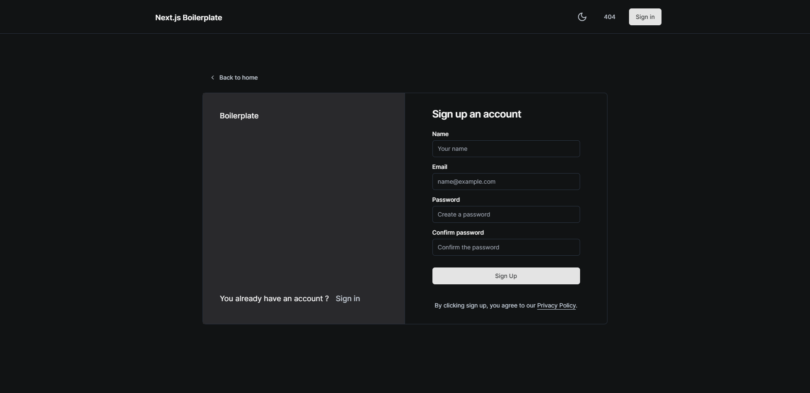

<h1 align="center">🚀 React-Nextjs-Boilerplate</h1>
<p align="center">
    Starter <a href="https://nextjs.org/">Next.js</a> (13+) template for your React projects.<br />
    If you like the project, feel free to put a ⭐ ! If you need help, join the <a href="https://discord.gg/G6WQsMQShZ">server support</a>.
</p>

<br>

<p align="center">
    <a title="MIT License" href="LICENSE"></a>
    <a title="CodeFactor" href="https://www.codefactor.io/repository/github/antoinemcx/react-nextjs-boilerplate">
        
    </a>
    <a title="Stars" href="[LICENCE](https://github.com/antoinemcx/react-nextjs-boilerplate)">
        
    </a>
    <a title="Support server" href="https://discord.gg/G6WQsMQShZ">
        
    </a>

   <br>
</p>

## 📚 Features

What's first :

-   🚀 Production-ready with a starter file structure !
-   🌈 Modern theme using shadcn/ui and with global css variables
    -   ✏️ Responsive navbar
    -   💄 Custom UI components (dropdown menus, buttons, headings, toast notifications, ...)
    -   ⏳ Loading page and states for buttons
-   🌙 Dark/Light/System mode (thanks to [next-themes](https://www.npmjs.com/package/next-themes))
-   👮 Private routing
-   🔐 Beautiful sign up and sign (with credentials or google account) in pages
-   ❌ Custom error pages (404 and others)
-   📡 MySQL (or other) database integration

For a better developer experience :

-   🔥 Full-stack application with [Next.js](https://nextjs.org/) (minify, live reload, etc.)
-   ⚡ [TypeScript](https://www.typescriptlang.org/) for type checking
-   💯 **95+** lighthouse score
-   🎨 Integrate with [Tailwind CSS](https://tailwindcss.com/) (processed by [PostCSS](https://postcss.org/))
-   ✏️ Linter with [ESLint](https://eslint.org/) and code formatter with [Prettier](https://prettier.io/) (default configs)
-   💡 Absolute Imports using `@` prefix
-   🔑 Authentication system using [Prisma](https://www.prisma.io/) and [next-auth](https://github.com/nextauthjs/next-auth)
-   🗂 VSCode settings configuration
-   🗺️ Sitemap.xml files and robots.txt with [next-sitemap](https://www.npmjs.com/package/next-sitemap)

<br>

## 📸 Screenshots

_Click on each arrow to see the screenshots :_

<details>
    <summary>Home page (dark)</summary>
    
</details>

<details>
    <summary>Home page (light)</summary>
    
</details>

<details>
    <summary>Home page (mobile)</summary>
    
</details>

<details>
    <summary>Error page</summary>
    
</details>

<details>
    <summary>Login page</summary>
    
</details>

<details>
    <summary>Register page</summary>
    
</details>

<br>

## 🚀 Getting Started

### 1. Clone the repository

```bash
git clone --depth=1 https://github.com/React-Nextjs-Boilerplate/React-Nextjs-Boilerplate.git <YOUR_PROJECT_NAME>
cd <YOUR_PROJECT_NAME>
```

### 2. Installation

Install the dependencies :

```bash
npm install
# or
yarn install
# or
pnpm install
```

### 3. Database Setup

This template uses a database for the authentication of next-auth.  
Create the MySQL/MariaDB database and insert the database URL in the **.env** file.<br>


After creating the database, run following command :

```bash
npx prisma migrate deploy
# or
yarn prisma migrate deploy
# or
pnpx prisma migrate deploy
```

### 4. Configuration

Rename the **.env.example** file in the root directory into **.env**.  
For more information on what to put in the file, please refer to the [configuration guide](/docs/CONFIGURATION.md).

### 5. Run the development server:

```bash
npm run dev
# or
yarn dev
# or
pnpm dev
```

Now open [http://localhost:3000](http://localhost:3000) with your favorite browser to see the application.

### 6. You liked it ? Star it :

**Optional** : Add a ⭐ to the repository, it helps a lot. Thanks !

<br>

## 📄 Documentation

-   [Configuration](/docs/CONFIGURATION.md) : Guide for getting the values for the **.env** file
-   [Cleaning](/docs/CLEANING.md) : Files to remove to be ready to code
-   [Prisma migrations](/docs/prisma_migrations.md) : How to create and manage migration files for your database using Prisma

## 🛠 Scripts

In development, you will mainly use `yarn dev` ; however, here are all the scripts available :

| `yarn <script>`, `npm run <script>` or `pnpm <script>` | Description                                                                                              |
| ------------------------------------------------------ | -------------------------------------------------------------------------------------------------------- |
| `dev`                                                  | Launch your app on localhost:300                                                                         |
| `build`                                                | Builds the application for production and regenerate the sitemap                                         |
| `start`                                                | Serves your app for production or preview                                                                |
| `lint`                                                 | [Lints](https://en.wikipedia.org/wiki/Lint_%28software%29) the project to review errors before launching |

<br>

## 💭 More information

For any errors found, please contact me [here](https://discord.gg/G6WQsMQShZ) or do a pull request.  
This repository is licensed under the MIT License. See the `LICENSE` file ([here](LICENSE)) for more information.

### Made with ❤️ by [antoinemcx](https://github.com/antoinemcx) in TypeScript.
